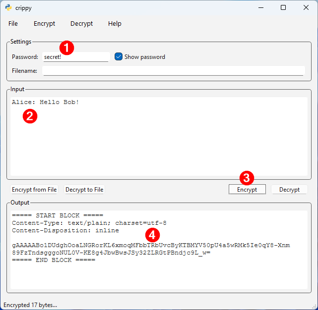
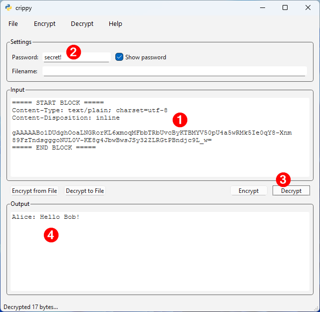

# Crippy

Crippy is a (Windows) tool to encrypt / decrypt blobs of data (either plain text or (binary) files) from and to BASE64 encoded blocks.

## Requirements

The development environment requires a (global) install of:

- [GNU `make`](https://www.gnu.org/software/make/) (for example from [Chocolatey](https://community.chocolatey.org/packages/make))
- [`uv`](https://github.com/astral-sh/uv) from [Astral](https://astral.sh/)
- [Inno Setup](https://jrsoftware.org/isinfo.php)

## Security

No guarantees are provided regarding the security of the encryption and decryption processes. Crippy uses the [`cryptography.fernet.Fernet`](https://cryptography.io/en/latest/fernet/#cryptography.fernet.Fernet) class from [`cryptography`](https://pypi.org/project/cryptography/). For deriving a cryptographic key from a password the [PBKDF2HMAC](https://cryptography.io/en/latest/hazmat/primitives/key-derivation-functions/#cryptography.hazmat.primitives.kdf.pbkdf2.PBKDF2HMAC) algorithm is used with 1.5M iterations.

Although this will break interoperability between versions, you can generate your own unique `SALT` (in `crippy_app.py`). Use something like this to generate a new `SALT`:

```python
import secrets
secrets.token_hex(16)
```

Please realize: a somewhat determined attacker can always extract the SALT from the executable. The SALT only protects you from a rainbow tables attack.

## Usage

### Encrypt



1. Enter a password.
2. Enter text you want to encrypt (or drag a file into the input box).
3. Click the `[Encrypt]` button.
4. Copy your text and transfer it (for example as email).

### Decrypt



1. Enter the encrypted blob in the _Input_.into the input box.
2. Enter the password.
3. Click the `[Decrypt]` button (or click `[Decrypt to File]` to decrypt a file).
4. Decrypted text appears in the _Output_.

## Copyright and license

Crippy is released as open source.

License terms: GPL3 (<https://www.gnu.org/licenses/gpl-3.0.html>). For more information, see the LICENSE file.
